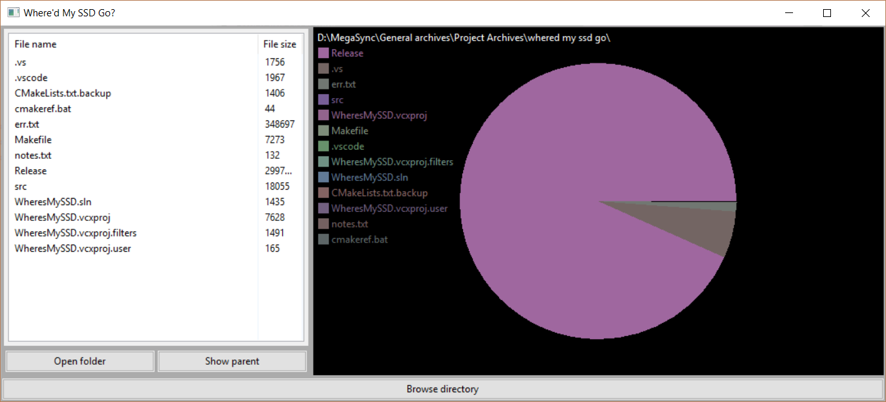

# Where'd My SSD Go?
I came up with the idea for this program after I got my new computer with a 128 GB main drive. I made it and uploaded it here because I thought it might be helpful to someone else.

## Requirements
Windows operating system (More coming later)  
.NET framework for VC 2017 [Download](https://aka.ms/vs/15/release/vc_redist.x86.exe)

## Screenshots

## Download
You can find the latest download on the releases tab of this page. Don't forget that you require
the necessary Microsoft Visual C++ redistributable.

[Microsoft download page](https://support.microsoft.com/en-us/help/2977003/the-latest-supported-visual-c-downloads)
[Direct link for x86 C++ redistributable](https://aka.ms/vs/15/release/vc_redist.x86.exe)

## Dependancies
wxWidgets 3.1 (Might work with similar versions, but hasn't been tested)